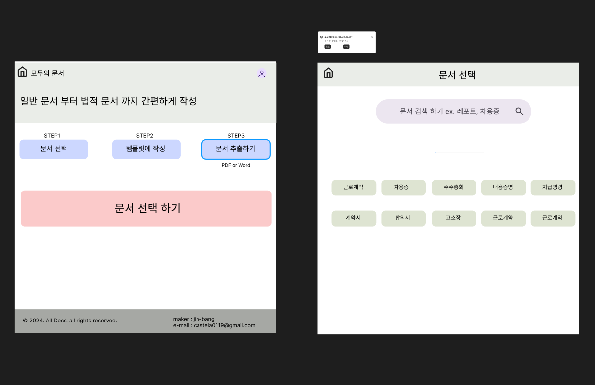

# [모두의 문서](https://findalldocs.com/)

## 1. 프로젝트 소개
**프로젝트 요약**  
모두의문서는 사용자들이 다양한 문서(예: 대출 계약서, 고용 계약서, 부동산 계약서 등)를 쉽게 생성, 저장 및 관리할 수 있는 웹 애플리케이션입니다. 이 프로젝트는 문서 관리의 복잡성을 줄이고 사용자가 필요할 때 필요한 서류를 빠르게 생성하고 보관할 수 있도록 돕습니다.

**FIGMA 링크 및 미리보기**  
[모두의문서 FIGMA 보기](https://www.figma.com/design/LfSURIapN7wPURtKt3GV6d/%EB%AA%A8%EB%91%90%EC%9D%98%EB%AC%B8%EC%84%9C?node-id=0-1&t=9lQOcW9HK9zy0i0Y-1)


---

## 2. 주요 기능 목록
- **문서 작성**: 문서 양식을 선택하여 미리보기 환경에서 문서를 쉽게 작성할 수 있습니다.
- **문서 저장**: 로그인한 사용자는 문서를 생성 및 저장할 수 있습니다.
- **문서 조회**: 로그인한 사용자는 저장한 문서를 쉽게 조회하고 관리할 수 있습니다.
- **PDF 추출**: 생성한 문서를 PDF 형식으로 저장하거나 다운로드할 수 있습니다.

---

## 3. 기술 스택 및 아키텍처

### Frontend
- **Vue.js**: 사용자 인터페이스와 동적인 웹 애플리케이션 개발을 위해 사용했습니다.
- **Quasar**: Vue.js 기반으로 UI 구성 요소와 스타일링을 간편하게 제공합니다.

### Backend
- **Spring Boot**: REST API 서버로 활용하여 데이터 처리 및 비즈니스 로직을 관리합니다.

### Database
- **MongoDB**: 비관계형 데이터베이스로, 문서와 사용자 데이터를 저장하고 관리합니다.

### DevOps / 인프라
- **AWS Route 53**: 도메인 이름 등록 및 DNS 관리를 통해 사용자들이 AllDocs에 접근할 수 있도록 지원합니다.
- **AWS S3**: 정적 파일 (프론트엔드 빌드 파일)을 호스팅하여 빠르고 안정적으로 서비스를 제공합니다.
- **AWS EC2**: 백엔드 서버(Spring Boot)와 MongoDB를 호스팅하여 안정적인 서버 환경을 제공합니다.

### 아키텍처 다이어그램 (선택 사항)
```plaintext
사용자 (User) 
      |
      ▼
Route 53 (DNS)
      |
      ├────────▶ S3 (Frontend) - Vue.js 애플리케이션
      |
      └────────▶ EC2 (Backend) - Spring Boot API
                      |
                      ▼
                MongoDB (Database)
```

---

## 4. 주요 폴더 구조
```bash
src
├── assets
├── components
│   ├── icons
│   ├── LoginModal.vue
│   ├── RegisterModal.vue
│   ├── TheFooter.vue
│   └── TheHeader.vue
│
├── plugins
│   └── apiUrl.js
│
├── router
│   └── index.js
│
├── stores
│   ├── auth.js
│   └── counter.js
│
├── views
│   ├── guest
│   │   ├── BorrowDocumentCmplGuest.vue
│   │   └── BorrowDocumentGuest.vue
│   ├── BorrowDocument.vue
│   ├── BorrowDocumentDetail.vue
│   ├── DocStorage.vue
│   ├── HomeView.vue
│   ├── OAuthRedirect.vue
│   └── PaperType.vue
│
├── App.vue
├── main.js
├── .env
├── index.html
└── vite.config.js

```

---

## 5. 배포 설명

### AWS 서비스 사용
- **Route 53**: AWS Route 53을 사용하여 도메인 이름을 등록하고 관리하며, 사용자 요청을 EC2 인스턴스와 S3 버킷으로 라우팅합니다.
- **S3**: 정적 웹사이트 호스팅을 위해 Vue.js로 빌드된 프론트엔드 파일을 S3에 배포합니다. S3는 정적 자산을 제공하여 사용자에게 빠른 응답을 보장합니다.
- **EC2**: 백엔드(Spring Boot API 서버)와 MongoDB 데이터베이스를 AWS EC2 인스턴스에 배포하여 서버가 안정적으로 작동하도록 합니다. 

### CI/CD 파이프라인
- **CI/CD 도구**를 통해 배포 자동화를 설정하여 코드가 변경될 때마다 자동으로 빌드 및 배포가 이루어집니다. 예를 들어, Jenkins 또는 GitHub Actions 같은 CI/CD 도구를 사용하여 다음과 같은 작업을 수행합니다:
  - **코드 푸시 시 빌드**: 새로운 코드가 푸시될 때 자동으로 빌드를 시작합니다.
  - **자동 테스트**: 주요 기능에 대한 테스트를 수행하여 코드 안정성을 보장합니다.
  - **S3 및 EC2 배포**: 빌드가 성공하면 S3 버킷과 EC2 인스턴스로 자동 배포합니다.

---

## 6. 향후 개선 사항 및 과제

### 우선 개선 사항
- **OAuth 및 JWT 적용**: 현재 단순한 랜덤 토큰 생성 방식을 OAuth와 JWT를 활용한 토큰 만료 및 암호화 방식으로 강화하여 보안을 높일 예정입니다.
- **비밀번호 암호화 저장**: 회원가입 시 **BCrypt** 해싱을 사용해 비밀번호를 암호화하여 저장할 예정입니다.
- **AWS를 통한 SSL 적용**: AWS Certificate Manager를 사용해 SSL을 적용하여 데이터 전송 보안을 강화할 예정입니다.

### 향후 개선 사항
- **SMTP 메일 인증 추가**: 회원가입 시 **SMTP 메일 서비스**를 통해 사용자 이메일로 인증 메일을 발송하여, 인증 완료 후 가입이 완료되는 방식으로 보안을 강화할 예정입니다.
- **계약서 서명 기능 추가**: 사용자가 계약서에 전자 서명을 추가할 수 있는 기능을 도입하여, 온라인으로 문서의 법적 효력을 강화할 예정입니다.

---
